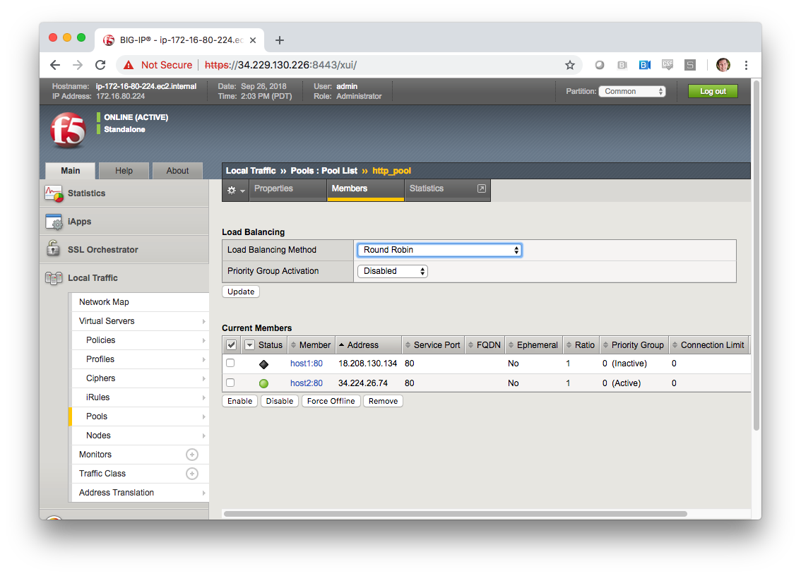

# 演習 2.0 - プールメンバーの無効化

**Read this in other languages**:  [English](README.html),   [日本語](README.ja.html).

## 目次

- [目的](#目的)
- [解説](#解説)
- [Playbook の出力](#Playbookの出力)
- [解答](#解答)

# 目的

本演習では、ステップごとに完全なガイドを提供するのではなく、ステップごとのヒントを示した情報が提供されます。
以下を実行する Playbook を構築して、プールからノードを削除します。
-	/Common/http_poolプールのBIG-IPからファクト情報を取得する。
-	プール メンバーのステータスを端末ウィンドウに表示する。
-	プール メンバーをファクト情報として格納する。
-	プール メンバーのIPおよびポート情報を端末ウィンドウに表示する。
-	プール内の特定メンバー、または全メンバーをDisableにするようにユーザにプロンプトを表示する。
-	プール メンバーをオフラインにする。

# 解説

## Step 1:

テキストエディタを使用して、`disable-pool-member.yml`という名前の新しいファイルを作成します。


```
[student1@ansible ~]$ nano disable-pool-member.yml
```


>`vim`および`nano`は、コントロール ノードだけでなく、RDPを介してVisual StudioおよびAtomでも使用できます

## Step 2:

以下の定義を`disable-pool-member.yml`に Playbook に入力します:


``` yaml
---

- name:  Disabling a pool member
  hosts: lb
  connection: local
  gather_facts: false

```


## Step 3

次に、タスク セクションを追加して、上記の目的のためのタスクを作成します。
一度プロバイダーを設定すると、各タスクに対して接続先サーバやユーザ・パスワードといった認証情報を定義する必要はありません。次回以降のタスクについて、本プロバイダー情報を再利用できます。


```
---
- name: "Disabling a pool member"
  hosts: lb
  gather_facts: false
  connection: local

  tasks:
  - name: Setup provider
    set_fact:
     provider:
      server: "{{private_ip}}"
      user: "{{ansible_user}}"
      password: "{{ansible_ssh_pass}}"
      server_port: "8443"
      validate_certs: "no"
```


プロバイダーは以下のように利用します:


```
    bigip_device_facts:
      provider: "{{provider}}"
      gather-subset:
      - ltm-pools
```


各モジュールで、接続先サーバやUser/passwordといった認証情報を入力する必要はありません。

## Step 4

次に下記のタスクを追加します。

  - LTM Poolのサブセット情報をBIG-IPからファクト情報として取得する

HINT: <a href="../1.1-get-facts/README.ja.html" style="color: #000000">演習 1.1</a>で実施したbigip_device_factsモジュールの利用。

## Step 5

次に下記のタスクを追加します:

  - 端末ウィンドウにプール情報を表示

ヒント:
上記 Step 出力内容の Loop 検索、または<a href="https://docs.ansible.com/ansible/latest/modules/debug_module.html" style="color: #000000"> debug moduleの利用となります</a>

## Step 6

次に下記のタスクを追加します:

  - ファクト情報に従い、プール名を格納

HINT: Playbook 内で動的に各ファクト情報を簡易設定する方法は<a href="https://docs.ansible.com/ansible/latest/modules/set_fact_module.html" style="color: #000000">set_fact module</a>の利用となります。

## Step 7

次に下記のタスクを追加します:

  - プールに所属しているメンバーを表示

ヒント:
<a href="https://docs.ansible.com/ansible/latest/modules/debug_module.html" style="color: #000000">debug</a> と <a href="../1.4-add-pool-members/README.ja.html">演習 1.4</a>を参照してください。

## Step 8

次に下記のタスクを追加します:

  - 特定メンバー、または全メンバーをdisableするためにHost:Port情報を入力するようにプロンプト表示

ヒント:
<a href="https://docs.ansible.com/ansible/latest/user_guide/playbooks_prompts.html" style="color: #000000">prompts</a> モジュールを利用してください。

## Step 9

次に下記のタスクを追加します:

  - プロンプト情報を読み、全メンバー、または指定されたメンバーを無効にする。

ヒント:
<a href="https://docs.ansible.com/ansible/latest/user_guide/playbooks_conditionals.html" style="color: #000000"> when による条件分岐とループ </a> と [BIG-IP pool member module](https://docs.ansible.com/ansible/latest/modules/bigip_pool_member_module.html)を参照してください。

## Step 10
Playbook の実行 - コントロールホストへ戻り、以下のコマンドを実行します:

```
[student1@ansible ~]$ ansible-playbook disable-pool-member.yml
```

# Playbookの出力

以下のような出力となります。


```yaml
[student1@ansible ~]$ ansible-playbook disable-pool-member.yml

PLAY [Disabling a pool member] ******************************************************************************************************************************

TASK [Setup provider] *******************************************************************************************************************************
ok: [f5]

TASK [Query BIG-IP facts] ***********************************************************************************************************************************
changed: [f5]

TASK [Display Pools available] ******************************************************************************************************************************
ok: [f5] => (item=http_pool) => {
    "msg": "http_pool"
}

TASK [Store pool name in a variable] ************************************************************************************************************************
ok: [f5] => (item=None)
ok: [f5]

TASK [Show members belonging to pool http_pool] *************************************************************************************************************
ok: [f5] => (item=host1:80) => {
    "msg": "host1:80"
}
ok: [f5] => (item=host2:80) => {
    "msg": "host2:80"
}

TASK [pause] ************************************************************************************************************
[pause]
To disable a particular member enter member with format member_name:port
To disable all members of the pool enter 'all':
host1:80

TASK [Disable ALL pool members] ************************************************************************************************************************
skipping: [f5] => (item=host1:80)
skipping: [f5] => (item=host2:80)

TASK [Disable pool member host1:80] *************************************************************************************************************************
changed: [f5]

PLAY RECAP **************************************************************************************************************
f5                         : ok=7    changed=2    unreachable=0    failed=0
```


# 解答
問題がある場合は講師より[解答](./disable-pool-member.yml)が提供されます。GUIにより以下のように表示されます。黒いひし形のマークは、そのノードがオフラインにされたことを示します。



--
この演習はこれで終了です。 [Click here to return to the lab guide](../README.ja.html)
